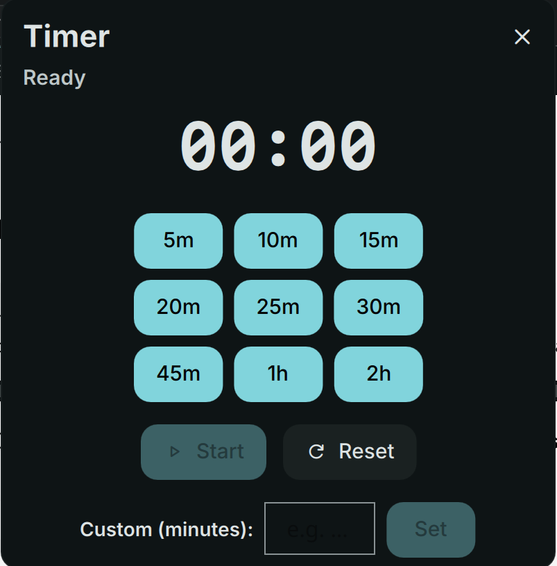

# Timer

Countdown timer with presets and notifications.



## Install


**Required:** This plugin requires [dms-common](https://github.com/hthienloc/dms-common) to be installed.

```bash
# 1. Install shared components
git clone https://github.com/hthienloc/dms-common ~/.config/DankMaterialShell/plugins/dms-common

# 2. Install this plugin
dms plugins install timer
```

Or manually:
```bash
git clone https://github.com/hthienloc/dms-timer ~/.config/DankMaterialShell/plugins/timer
```

## Features

- **Quick presets** - Customizable minute buttons
- **Desktop notification** - Alerts when timer finishes
- **Custom sound** - Use system sound or set your own
- **Auto-reset** - Option to reset after completion
- **Custom "When Done" Actions** - Choose system actions (Lock, Sleep, Hibernate, Shutdown) directly inside the popout or set a custom command to trigger on timeout

## Usage


| Action | Result |
|--------|--------|
| Left click | Open timer (when ready) / Pause / Resume (when active) |
| Right click | Quick start (when ready) / Reset (when active) |

## External Control (IPC)

Use `dms ipc call timer <command> [args]` to control the timer from scripts or keybindings.

| Command | Arguments | Description | Returns |
|---------|-----------|-------------|---------|
| `toggle` | *None* | Toggle pause/resume (starts quick start timer if ready) | `STARTED (Xm)`, `RUNNING`, `PAUSED` |
| `pause` | *None* | Pause the active timer | `PAUSED`, `ALREADY_PAUSED` |
| `resume` | *None* | Resume the paused timer | `RUNNING`, `ALREADY_RUNNING`, `STARTED (Xm)` |
| `start` | `minutes` | Start the timer with a specific duration (1-999) | `STARTED (Xm)`, `ERROR: ...` |
| `reset` | *None* | Reset and stop the timer | `RESET` |
| `getStatus` | *None* | Get current state, remaining time, total time, and formatted display in JSON | JSON string |

### Scripting & Keybinding examples

**Quick Pause/Resume Hotkey (Hyprland):**
```ini
bind = SUPER_SHIFT, T, exec, dms ipc call timer toggle
```

**Get Formatted Time in Script:**
```bash
# Print the remaining time (e.g., "24:59")
dms ipc call timer getStatus | jq -r '.formatted'
```

## License

GPL-3.0

## Roadmap / TODO

- [ ] **Pomodoro Support**: Dedicated mode with automated work/break cycles and session tracking.
- [ ] **Extended Precise Input**: Support for `HH:MM:SS` format in manual input for long-running tasks.
- [x] **Custom "When Done" Actions**: Execute shell commands or trigger system actions (Lock, Suspend) on timeout.
- [ ] **Multi-Timer Manager**: Support for labeling and tracking multiple concurrent countdowns.
- [x] **External Control (IPC)**: API to start, pause, or reset timers via command line or external scripts.
- [ ] **Improved Persistence**: Save active timer state to disk to survive session restarts.


